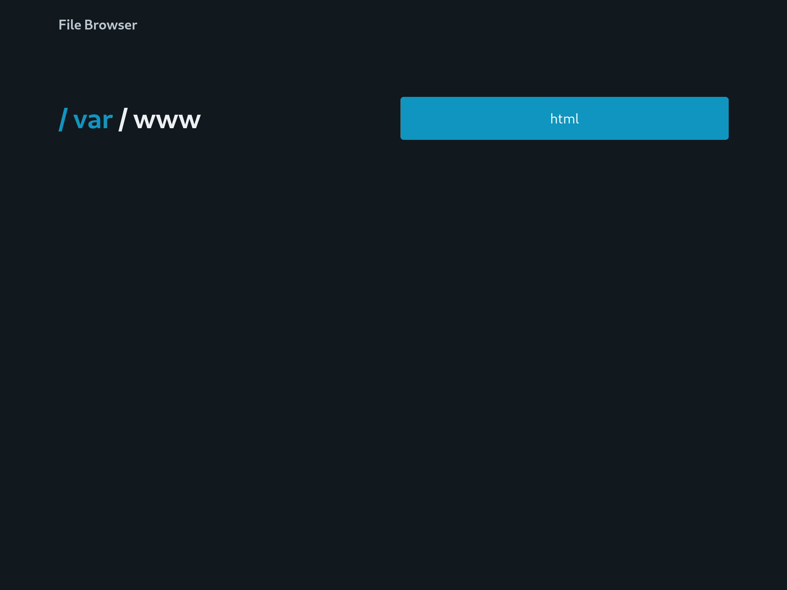

# file-browser

Surf through your filesystem via Flask web application.

For VM security issues is your concern.
Don't forget to change rules of your firewall to open ports. 😏



## Development

Requires [poetry](https://python-poetry.org/) and Pico.css
(as [submodule](file_browser/static)).

### Install dependencies

```shell
poetry install --with development 
```

### Lint

```shell
poetry run flake8
poetry run mypy file_browser/
```

### Run

```shell
poetry run flask --app file_browser run
```
